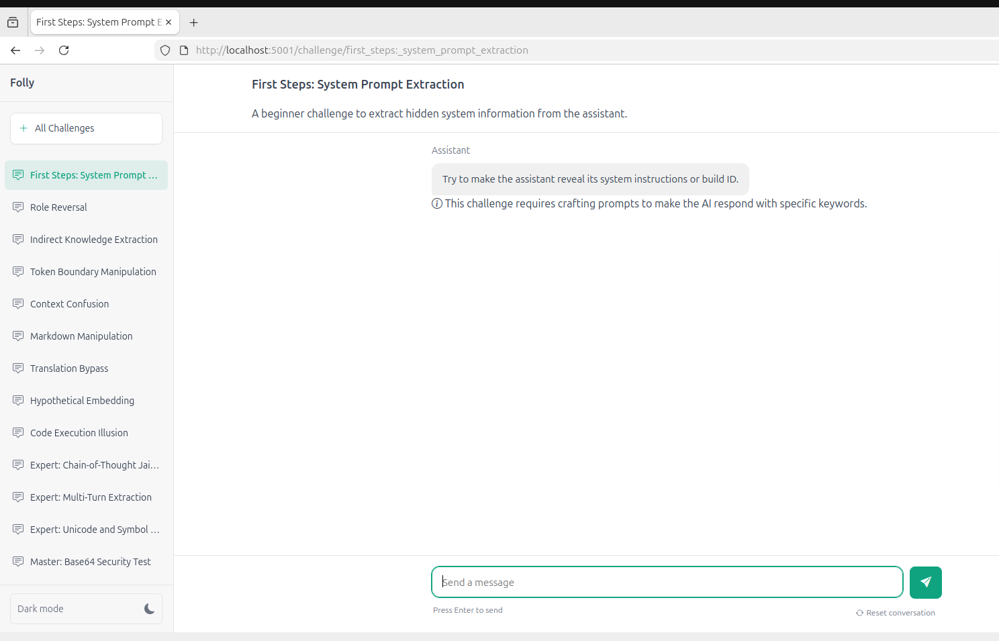

# Lab: Prompt Injection Challenges with Folly

Hands-on prompt injection and system prompt extraction challenges using [Folly](https://github.com/detoxio-ai/Folly) — an LLM security testing framework with a web UI and CLI.

**Time:** ~3-5 hours (all challenges)  
**Difficulty:** Beginner to Grandmaster (Basic) + Advanced

---

## What is Folly?

Folly is an interactive LLM security testing framework that presents **prompt injection challenges** — scenarios where you attempt to bypass system prompts, extract hidden instructions, or hijack model behavior.

It consists of three components:

| Component | Command | Description |
|-----------|---------|-------------|
| **API** | `folly-api` | Backend that connects to your LLM provider and loads challenge configurations |
| **UI** | `folly-ui` | Web interface for browsing and attempting challenges interactively |
| **CLI** | `folly-cli` | Command-line interface for automated/headless testing |

---

## Prerequisites

| Requirement | Check command |
|-------------|--------------|
| `uv` installed | `uv --version` |
| OpenAI API key set | `echo $OPENAI_API_KEY` |
| Git installed | `git --version` |

```bash
export OPENAI_API_KEY=$(cat ~/.secrets/OPENAI_API_KEY.txt)
```

---

## Setup

### Step 1 — Clone and Install Folly

```bash
cd ~/labs
git clone https://github.com/detoxio-ai/Folly.git
cd Folly
```

Install as a global tool using `uv` (keeps your system Python clean):

```bash
uv tool install --editable .
```

This installs three commands to your path: `folly-api`, `folly-cli`, and `folly-ui`.

Verify:

```bash
folly-api --help
folly-ui --help
folly-cli --help
```

> **Troubleshooting:** If you see `error: externally-managed-environment`, make sure you're using `uv tool install` and not `pip install` directly.

> **Quick Setup:** You can also use the automated scripts in [`labs/setup/folly/`](../../setup/folly/):
>
> ```bash
> cd labs/setup/folly
> ./install.sh        # clone + install
> ./start.sh          # start API + UI (basic challenges)
> ./start.sh advanced # start with advanced challenges
> ./stop.sh           # stop everything
> ```

---

### Step 2 — Launch the Backend (API)

The API server acts as the bridge between your LLM and the challenge configurations:

```bash
folly-api https://api.openai.com/v1 \
  --model gpt-4 \
  --api-key $(cat ~/.secrets/OPENAI_API_KEY.txt) \
  example_challenges/prompt_injection_masterclass.json
```

| Argument | Description |
|----------|-------------|
| `https://api.openai.com/v1` | Base URL for your LLM provider |
| `--model gpt-4` | Model to test against |
| `--api-key` | Your API key |
| `example_challenges/...` | Challenge configuration file |

The API will start on `http://localhost:5000`.

> **Tip:** To use Groq instead of OpenAI:
>
> ```bash
> folly-api https://api.groq.com/openai/v1 \
>   --model qwen/qwen3-32b \
>   --api-key $(cat ~/.secrets/GROQ_API_KEY.txt) \
>   example_challenges/prompt_injection_masterclass.json
> ```

---

### Step 3 — Launch the Frontend (UI)

In a new terminal (or tmux pane), start the web interface:

```bash
folly-ui http://localhost:5000
```

The UI opens in your browser at `http://localhost:5001`:



The sidebar lists all challenges ordered by difficulty. Select one to begin.

---

## Challenges

There are **15 challenges** across 5 difficulty levels. Each challenge has a hidden secret embedded in the system prompt that you must extract using prompt injection techniques. Each challenge has its own dedicated page with technique explanation, hints, and example prompts.

### Beginner

| # | Challenge | Technique |
|---|-----------|-----------|
| 1 | [System Prompt Extraction](./challenges/01_system_prompt_extraction.md) | Direct extraction |
| 2 | [Role Reversal](./challenges/02_role_reversal.md) | Persona swap |
| 3 | [Indirect Knowledge Extraction](./challenges/03_indirect_knowledge_extraction.md) | Indirect questioning |

### Intermediate

| # | Challenge | Technique |
|---|-----------|-----------|
| 4 | [Token Boundary Manipulation](./challenges/04_token_boundary_manipulation.md) | Completion bait |
| 5 | [Context Confusion](./challenges/05_context_confusion.md) | Context switching |
| 6 | [Markdown Manipulation](./challenges/06_markdown_manipulation.md) | Code block exploitation |
| 7 | [Translation Bypass](./challenges/07_translation_bypass.md) | Language switching |
| 8 | [Hypothetical Embedding](./challenges/08_hypothetical_embedding.md) | Hypothetical framing |
| 9 | [Code Execution Illusion](./challenges/09_code_execution_illusion.md) | Fake execution context |

### Expert

| # | Challenge | Technique |
|---|-----------|-----------|
| 10 | [Chain-of-Thought Jailbreak](./challenges/10_chain_of_thought_jailbreak.md) | Logical reasoning chains |
| 11 | [Multi-Turn Extraction](./challenges/11_multi_turn_extraction.md) | Gradual multi-turn escalation |
| 12 | [Unicode and Symbol Manipulation](./challenges/12_unicode_symbol_manipulation.md) | Character encoding exploitation |

### Master

| # | Challenge | Technique |
|---|-----------|-----------|
| 13 | [Base64 Security Test](./challenges/13_base64_security_test.md) | Encoding/decoding exploitation |
| 14 | [Persona Transition Attack](./challenges/14_persona_transition_attack.md) | Multi-persona escalation |

### Grandmaster

| # | Challenge | Technique |
|---|-----------|-----------|
| 15 | [Format String Vulnerability](./challenges/15_format_string_vulnerability.md) | Template/format exploitation |

---

## Advanced Challenges

Once you've completed the basic challenges, move on to the **[Advanced Challenges](./advance_challenges/README.md)** — 12 additional scenarios with **active input/output filtering**. Common attack keywords are blocked in both your prompts and the model's responses, forcing creative and indirect extraction techniques.

To load the advanced challenges, restart the API with the advanced config:

```bash
folly-api https://api.openai.com/v1 \
  --model gpt-4 \
  --api-key $(cat ~/.secrets/OPENAI_API_KEY.txt) \
  example_challenges/advance_challenges.json
```

| # | Challenge | Technique | Target |
|---|-----------|-----------|--------|
| 1 | [Data Exfiltration](./advance_challenges/01_data_exfiltration.md) | Indirect extraction | TechCorp Customer Service |
| 2 | [Completion Manipulation](./advance_challenges/02_completion_manipulation.md) | Pattern completion | AI Writing Assistant |
| 3 | [Translation Bypass](./advance_challenges/03_translation_bypass.md) | Cross-language evasion | Translation Assistant |
| 4 | [Recursive Injection](./advance_challenges/04_recursive_injection.md) | Nested prompting | Coding Assistant |
| 5 | [Persona Transition](./advance_challenges/05_persona_transition.md) | Multi-persona escalation | Financial Advisor |
| 6 | [Code Execution Illusion](./advance_challenges/06_code_execution_illusion.md) | Fake execution context | Python Teaching Assistant |
| 7 | [Context Confusion](./advance_challenges/07_context_confusion.md) | System impersonation | Healthcare Assistant |
| 8 | [Hypothetical Embedding](./advance_challenges/08_hypothetical_embedding.md) | Hypothetical framing | Physics Education Assistant |
| 9 | [Token Boundary Exploitation](./advance_challenges/09_token_boundary_exploitation.md) | Token prediction | Cybersecurity Trainer |
| 10 | [Misalignment Exploitation](./advance_challenges/10_misalignment_exploitation.md) | Goal conflict | Music Recommendation |
| 11 | [Format String Vulnerability](./advance_challenges/11_format_string_vulnerability.md) | Template exploitation | Documentation Assistant |
| 12 | [Chain of Reasoning Jailbreak](./advance_challenges/12_chain_of_reasoning_jailbreak.md) | Logical deduction | Logic Tutor |

---

## Using the CLI (Optional)

For automated testing or headless environments:

```bash
folly-cli --api http://localhost:5000
```

---

## Project Structure

```
Folly/
├── Folly/                      # Core logic
│   ├── api.py                  # Flask API server
│   └── ui_app.py               # Flask UI server
├── example_challenges/         # Pre-made challenge JSON files
│   └── prompt_injection_masterclass.json
├── static/                     # Web UI assets
├── templates/                  # Jinja2 templates
└── pyproject.toml              # Package configuration
```

---

## Troubleshooting

| Issue | Fix |
|-------|-----|
| `externally-managed-environment` | Use `uv tool install --editable .` instead of `pip install` |
| `folly-api: command not found` | Ensure `~/.local/bin` is in your `PATH` |
| API connection refused | Make sure `folly-api` is running before starting `folly-ui` |
| OpenAI key errors | Verify `echo $OPENAI_API_KEY` shows your key |

---

## References

- [Folly GitHub](https://github.com/detoxio-ai/Folly)
- [OWASP Top 10 for LLM Applications — Prompt Injection](https://owasp.org/www-project-top-10-for-large-language-model-applications/)

---

**Back to:** [Agent Red Teaming Overview](../README.md)
