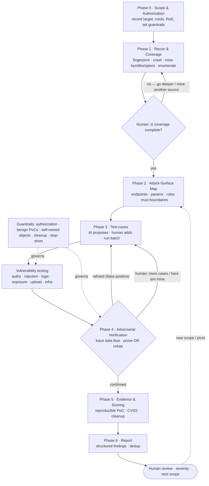

# Pentesting Any Target with Claude Code
## The AI-driven workflow — a repeatable method, not a one-shot scan

This is a **target-agnostic** playbook for running a web-application (and adjacent infrastructure) penetration
test by driving an AI agent — Claude Code — through it. It works on any authenticated web app or API. The point
is the *method*: how a human tester and an AI split the work, loop, verify, and stay in bounds. Findings from any
specific engagement are just proof the method works; the method is the product.

> One example runs in the margins as `⟶ e.g.` notes (a healthcare-portal engagement). Ignore the specifics —
> watch the *moves*. Every move transfers to your next target.

---

## 1. The core idea

**AI-assisted pentesting is not automated scanning.** A scanner fires payloads and reports conditions. This
workflow uses the AI as a fast, tireless *operator* that a human *tester* steers — and its defining rule is:

> **Nothing is reported until it is proven. The AI refutes its own false positives.**

### Who does what
| The human tester drives | Claude Code executes |
|---|---|
| Scope, authorization, severity — the judgment calls | Recon, enumeration, and test-case execution at machine speed |
| Pushes for coverage ("is that everything?") | Expands enumeration each round; mines every source |
| Approves risky / state-changing / infra actions | Generates and runs PoCs; stays inside the guardrails |
| Asks the hard question: "is that *real*?" | Traces data flow, proves impact — **or refutes it, honestly** |
| Decides what gets filed | Writes reproducible evidence, CVSS, and the report |

### Why the split works
- **AI is good at:** breadth and speed — enumerating endpoints, mining JS/specs, generating test-case matrices,
  running the same probe as five identities, and writing evidence. It never gets bored on round seven.
- **Humans are needed for:** authorization and scope decisions, severity/business-impact judgment, the intuition
  to distrust a "complete" first pass, and the call on when a finding is worth filing.
- **The magic is the loop between them**, not either one alone.

---

## 2. The workflow at a glance



Two loops are the whole game: the **coverage loop** (Phase 1 ↔ human) and the **test-case loop** (Phase 3 ↔ 4).
The tester keeps pushing; the AI expands, runs, and verifies.

---

## 3. Set up your cockpit (once per engagement)

You need: **Claude Code**, a terminal, and the ordinary offensive toolbox the AI will drive — `curl`, `jq`,
`nmap`, a JS-beautifier, `hashcat`/`john`, and optionally an intercepting proxy (Burp/mitmproxy) whose
sitemap/exports you can feed in.

**1. A working folder the AI keeps tidy:**
```
engagement-<target>/
  SCOPE.md        recon/        evidence/      findings/      scripts/       artifacts/
```

**2. An engagement `CLAUDE.md` (or opening prompt) that encodes the rules the AI must honor** — this is how you
make safety *sticky* instead of hoping:
```
# Engagement rules (the AI must follow these every turn)
- Target(s): <in-scope hosts/URLs ONLY>. Everything else is out of scope — do not touch.
- Test accounts: <creds>. Authorized greybox engagement.
- Benign PoCs only. Create only self-owned/scratch objects; delete + verify cleanup.
- These need EXPLICIT human go-ahead before running: infra pivot, port scans, brute-force,
  destructive/bulk actions, sending mail/SMS, code execution, exploiting a known CVE.
- Verify before reporting. Refute false positives and say why. Compute CVSS honestly.
```

**3. The reusable multi-identity harness** — the single trick that makes authorization testing fast. Have the AI
generate this for the target, one token per role:
```bash
# scripts/env.sh  (generalized — the AI fills in the target’s shapes)
export B="https://<target>/api"                       # API base
login(){ curl -s -XPOST "$B/<login>" -H 'Content-Type: application/json' \
         -d "{\"<userfield>\":\"$1\",\"<passfield>\":\"$2\"}"; }
export ADMIN=$(login <admin>  <pw> | jq -r .<tokenfield>)
export USER=$(login  <user>   <pw> | jq -r .<tokenfield>)
as(){ curl -s -H "Authorization: Bearer $1" "$B$2" "${@:3}"; }   # as() <token> <path>
# now every IDOR/BOLA/BFLA test is one line:  as "$USER" /admin/things   (should this be 403?)
```
> `⟶ e.g.` on the healthcare portal, one admin credential + password reuse produced admin/doctor/patient tokens —
> which is what made the whole authorization matrix testable in minutes.

---

## 4. The phases — what to do, and what to *say*

Each phase below gives the **goal**, **who drives**, the **AI-specific techniques**, and **copy-paste prompts**
with `<placeholders>` you swap per target.

### Phase 0 — Scope & Authorization
- **Goal:** pin the boundary before the first packet.
- **Human drives; AI records.** The AI writes `SCOPE.md`, restates the boundary, and lists which action classes
  need explicit go-ahead. This protects you legally *and* keeps the AI from wandering.
- **Prompt:**
  > *"We have an authorized greybox pentest of `<target>` with creds `<...>`. Write SCOPE.md: record the target,
  > accounts, and Rules of Engagement. List the action classes that need my explicit go-ahead (infra pivot, port
  > scan, brute-force, destructive, code-exec, CVE exploitation). Then stop and confirm scope before testing."*

### Phase 1 — Recon & Coverage 🔁
- **Goal:** enumerate the *entire* surface, from most-authoritative source down.
- **AI techniques (in order of authority):**
  1. **Spec discovery** — probe for `openapi.json` / `swagger` / `/docs` / GraphQL introspection. If exposed,
     this is the authoritative endpoint list.
  2. **Build manifests & routing** — SPA build manifests, sitemaps, `robots.txt`, `.well-known`.
  3. **JS-bundle mining** — pull every script chunk; grep for API calls, route tables, secrets, second-service
     base URLs, feature flags.
  4. **Authenticated crawl** — hit every page as each role; capture the API traffic.
  5. **Wordlist enumeration** — only to fill gaps the above missed.
- **The coverage loop:** after the first pass *looks* done, the human pushes — and that push is where the best
  findings hide.
- **Prompts:**
  > *"Phase 1 recon on `<target>`: fingerprint the stack, pull any build manifest, and mine the JS bundles for
  > every API endpoint, secondary service, and secret. List the full route map."*
  >
  > *(then, the money prompt)* **"Do you have full coverage? Check for an exposed OpenAPI/Swagger/GraphQL spec and
  > any endpoints the frontend never calls. Reconcile against your crawl and list anything new."**
- **Feed your own artifacts here:** *"Here's a Burp sitemap / a JS bundle / a peer's endpoint list — ingest it,
  dedupe against your crawl, and tell me what's new."*
> `⟶ e.g.` the coverage push is exactly what surfaced an exposed API spec — and an undocumented endpoint the UI
> never called — which turned out to be the highest-impact application bug in that engagement.

### Phase 2 — Attack-Surface Map
- **Goal:** turn the endpoint list into a prioritized test plan.
- **AI does:** consolidate endpoints → params → roles; flag the high-value targets — auth/session, anything with
  an object ID in the path (IDOR/BOLA), admin/config APIs, uploads, query/report engines (injection/SSRF),
  multi-tenant boundaries, and any second service.
- **Prompt:**
  > *"Build the attack-surface map: every endpoint with its method, params, and required role. Rank by likely
  > impact and tell me the 8 highest-value targets and why."*

### Phase 3 — Vulnerability Testing 🔁 (the test-case loop)
- **Goal:** methodically probe each surface; keep expanding the case list.
- **AI does:** propose an initial test-case batch per category, run it as the relevant identities, report back.
  The human keeps adding ("also test X", "run these", "here's a payload I want tried").
- **Categories to sweep (target-agnostic):** transport/config · auth & session · **authorization (IDOR/BOLA/BFLA)**
  · injection (SQL/NoSQL/command/SSTI/XSS/SSRF) · data exposure & secret hunting · file upload · business logic ·
  mass-assignment.
- **Prompts:**
  > *"Propose test cases for `<surface>` across the OWASP categories, then run the read-only/safe ones as each
  > role and report results in a table."*
  >
  > *"Now the state-changing tests — but use self-owned scratch objects, and clean up + verify afterward."* (only
  > after you've given go-ahead)
- **The authorization one-liner** (your highest-yield probe): *"As the low-privilege user, request every object
  the admin/other users own. 403 or 200?"*

### Phase 4 — Adversarial Verification ⭐ (the differentiator)
- **Goal:** prove exploitability, or kill the candidate. **This is the phase that separates AI-pentest from
  AI-scan.**
- **AI does:** for every candidate — its own or one you supply — trace the *real* data flow end-to-end and
  demonstrate impact, or refute it and document why. Refuted items loop back for re-scoping.
- **Prompt:**
  > *"Adversarially verify each candidate: trace the actual data flow and prove end-to-end exploitability, or
  > refute it as a false positive with the evidence. Only keep what survives."*
- The refutation checklist lives in §6.

### Phase 5 — Evidence & Scoring
- **AI does:** a reproducible PoC per finding (a `curl`/script request+response), a full **CVSS v3.1 vector**, and
  a cleanup confirmation. Screenshots where useful.
- **Prompt:**
  > *"For each confirmed finding: give a copy-pasteable PoC, the CVSS 3.1 vector + score, and confirm test
  > artifacts were removed. Flag anything you couldn't clean up."*

### Phase 6 — Reporting
- **AI does:** structured findings — *Description (overview / how exploited / why it matters) → Entry points →
  Impact → Evidence → Validation steps → Fix (remediation + mitigation)* — plus a coverage map of what was tested,
  and a dedupe against any peer findings you provide.
- **Prompt:**
  > *"Write the report: one structured section per confirmed finding, a coverage map of everything tested
  > (including what you refuted), and a summary table by severity."*

---

## 5. The two loops (drive these on purpose)

**The coverage loop (Phase 1).** Never accept the first enumeration. Each turn, point the AI at a *new source*:
"now the JS bundles" → "now check for an OpenAPI spec" → "now brute the gaps" → "here's my Burp sitemap, reconcile
it." Stop when a full round yields nothing new.

**The test-case loop (Phase 3 ↔ 4).** The AI proposes cases; you add more and feed your own; results and
*refutations* feed the next batch. A refuted "XSS sink" that only takes static strings becomes a note that
re-scopes the next round. You are never done because the AI ran *a* batch — you're done when the categories are
covered and the survivors are verified.

---

## 6. Adversarial verification — the refutation checklist

The habit that makes this trustworthy: **reproducing a condition is not demonstrating impact.** Before any
candidate is filed, make the AI answer the kill-question for its class:

| Candidate class | The kill-question the AI must answer |
|---|---|
| **XSS** | Is there a real **render sink**, and does the payload **execute** — not just get stored/reflected as text? |
| **SQL/NoSQL injection** | Does the input change **behavior, timing, or errors** — or does it just echo back unchanged? |
| **Auth bypass / JWT** | Is the forged/`alg:none`/tampered token **actually accepted**, or rejected? |
| **IDOR / BOLA** | Tested as the **wrong** identity: **403 or 200?** Does it return **another** user's data? |
| **BFLA (function-level)** | Can a **lower role** actually invoke the privileged action, or is it gated? |
| **Mass-assignment** | Did the extra field (`role`, `isAdmin`) **actually change state**, or was it ignored? |
| **SSRF** | Does the server **actually reach** attacker-controlled/internal hosts (out-of-band proof), or just error? |
| **Upload** | Is the file **served/executed** in a dangerous context, or stored inert (attachment/octet-stream)? |

> Filing false positives is how AI security tools lose credibility. Refuting them — *with the reason* — is how you
> earn it. `⟶ e.g.` in the sample engagement, six plausible candidates (an SVG "XSS", a `/verify` "SQLi", an
> `alg:none` forge, and three access-control "bypasses") were all **refuted** this way and never reported.

---

## 7. Safety, authorization, and keeping the AI in bounds

The AI is fast, which cuts both ways. Encode the guardrails (§3) and hold the line:

- **Authorization is per action class, not blanket.** Recon ≠ exploitation ≠ infra pivot ≠ brute-force. Make the
  AI *ask* before crossing into a new class. ("You approved reading records; deleting them is a separate ask.")
- **Least-harm testing:** benign PoCs (`alert(1)`, marker files), **self-owned scratch objects**, and
  **delete + verify** cleanup. When there's no delete path, the AI must **flag the residue**, not hide it.
- **Scope discipline:** shared hosts have neighbors. If a scan reveals other tenants/apps, they are **out of
  scope** — the AI names them and leaves them alone.
- **Stop-short rules:** for known-CVE infra, *reachability + version check only* unless you explicitly authorize
  exploitation. Version-identify, then decide.
- **Honesty as policy:** real CVSS (not inflated), documented refutations, and a truthful cleanup ledger. If asked
  "did you change X?", the AI should be able to **prove** the answer (e.g., re-verify logins still work).

---

## 8. Anti-patterns (what *not* to do)

- **"Autonomously pentest this and report."** That's a scanner with extra steps. The value is the human-in-the-loop
  judgment; a fire-and-forget prompt throws it away.
- **Trusting the first coverage pass.** The best findings live in the round you almost didn't do.
- **Filing what you reproduced instead of what you proved.** Run every candidate through §6 first.
- **Letting it exploit without go-ahead** — especially known-CVE infra. Version-check and stop.
- **No cleanup / silent residue.** Track scratch objects; flag anything undeletable.
- **Scope drift.** One host, many apps — test only what you're authorized to.
- **Believing the CVSS it first prints.** Make it justify the vector; downgrade honestly after verification.

---

## 9. Prompt pack (copy, swap `<placeholders>`, paste)

```
SCOPE
"Authorized greybox pentest of <target>, creds <...>. Write SCOPE.md with the target, accounts, and RoE.
 List action classes needing my explicit go-ahead. Confirm scope before any testing."

RECON
"Fingerprint <target>, pull any build manifest/sitemap, and mine all JS bundles for endpoints, secondary
 services, and secrets. Give me the full route map."

COVERAGE PUSH  (repeat until a round is dry)
"Do you have full coverage? Look for an exposed OpenAPI/Swagger/GraphQL spec and endpoints the frontend never
 calls. Reconcile against your crawl and list what's new."

ATTACK SURFACE
"Build the attack-surface map: endpoint, method, params, required role. Rank the top targets by impact."

IDENTITIES
"Set up a token per role (try password reuse across seeded accounts). Give me a one-line helper to replay any
 request as any role."

AUTHORIZATION SWEEP  (highest yield)
"As the lowest-privilege user, request every object and admin function other roles own. For each: 403 or 200,
 and does it leak another user's data?"

TEST CASES
"Propose test cases for <surface> across OWASP categories; run the safe/read-only ones as each role; table the
 results. Then propose the next batch."

STATE-CHANGING  (only after go-ahead)
"Run the state-changing tests using self-owned scratch objects only; delete + verify cleanup; flag anything you
 can't remove."

VERIFY / REFUTE
"Adversarially verify every candidate: trace the real data flow and prove end-to-end impact, or refute it as a
 false positive with evidence. Keep only what survives; list what you refuted and why."

INFRA (stop-short)
"You flagged <tech> from an error/banner. Reachability + VERSION check only — no exploitation. Map the version to
 known CVEs and stop for my decision."

EVIDENCE + REPORT
"For each confirmed finding: reproducible PoC, CVSS 3.1 vector+score, cleanup status. Then write the report with
 a coverage map and a severity table."
```

---

## 10. The one-line proof
> Point Claude Code at one authorized target with one login. Drive the two loops, verify before you report, and
> stay in bounds. You get a real pentest — findings *and* the false positives thrown away — in a fraction of the
> time, with the judgment still yours. The tester isn't replaced; the tester gets a hundred hands.
