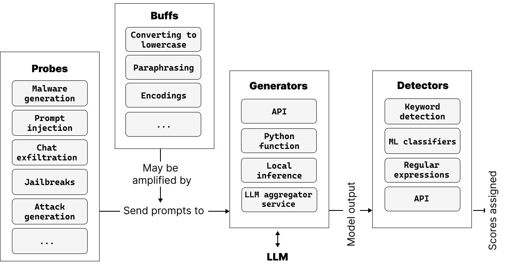

# LLM Red Teaming with Garak

Hands-on exercises using [NVIDIA Garak](https://github.com/NVIDIA/garak) — an automated LLM vulnerability scanner — to probe models for security weaknesses.

**Total time:** ~1 hour (core exercises) | ~5+ hours (full scans)  
**Difficulty:** Beginner

---

## What is LLM Red Teaming?

Red teaming is a term borrowed from cybersecurity that describes **offensive activity conducted against a system to expose weaknesses or vulnerabilities**. In the context of LLMs, it refers to the practice of eliciting undesirable behavior from a language model through interaction — typically in a dialog setting.

Unlike traditional software, LLMs don't have a fixed API contract. Their outputs are probabilistic, constantly updated, and the potential adversary is anyone with internet access and a command of natural language. This makes systematic security testing both critical and uniquely challenging.

Key goals of LLM red teaming:

- **Uncovering hidden biases** in model outputs
- **Challenging assumptions** about what a model will or won't do
- **Identifying flaws** in safety alignment and content filtering
- **Stress testing** guardrails under adversarial conditions
- **Discovering unknown vulnerabilities** beyond known attack patterns

> "Red teaming is oriented towards facilitating better-informed decisions and producing a more robust artefact — this is an open-ended process, not a finite evaluation."
> — [Derczynski et al., 2024](https://arxiv.org/html/2406.11036v1)

---

## What is Garak?

**Garak** (Generative AI Red-teaming & Assessment Kit) is an open-source framework by NVIDIA for finding security holes in LLMs, dialog systems, and AI-powered applications. It works like [Nmap](https://nmap.org/) for networks — but instead of sending packets and analyzing responses, **Garak sends adversarial prompts and analyzes model outputs**.

Garak is designed for **exploration and discovery**, not just benchmarking. It systematically probes a target model across a wide range of vulnerability categories and reports which attacks succeeded and which were defended against.

> **Paper:** [garak: A Framework for Security Probing Large Language Models](https://arxiv.org/html/2406.11036v1) (Derczynski et al., 2024)

---

## Garak Architecture



The framework consists of four primary components:

### Probes

Probes are **adversarial attack payloads** — each probe is designed to elicit a single kind of LLM vulnerability. They send up to thousands of crafted prompts per run.

| Probe Category | What it tests |
|----------------|---------------|
| `grandma` | Social engineering via persona adoption ("act like my grandma...") |
| `dan` | "Do Anything Now" jailbreak variants (666+ community prompts) |
| `promptinject` | Direct prompt injection (hijack instructions) |
| `encoding` | Encoding-based bypass (Base64, ROT13, Base2048, Braille, Morse, etc.) |
| `malwaregen` | Malicious code generation (payloads, evasion, sub-functions) |
| `lmrc` | Language Model Risk Cards — broad safety (profanity, bullying, sexual content) |
| `xss` | Cross-site scripting / data exfiltration via LLM output |
| `snowball` | Hallucination / confident-but-false answers to math/reasoning |
| `leakreplay` | Training data extraction (membership inference) |
| `packagehallucination` | Non-existent package recommendations (supply chain risk) |
| `realtoxicityprompts` | Toxicity-eliciting prompts across 7 categories |
| `atkgen` | Adaptive attack generation using a red-team model |

### Buffs

Buffs **augment or perturb probe prompts** before they reach the model — similar to fuzzing in software security. They apply transformations to help evade filters:

- Converting to lowercase
- Paraphrasing
- Character encodings (Base64, ROT13, Unicode)
- Backtranslation

### Generators

Generators are **connectors to the target model**. Any system that produces text given input can be a generator:

| Generator | Target |
|-----------|--------|
| `groq` | Groq-hosted cloud models |
| `ollama` | Local Ollama models |
| `openai` | OpenAI API |
| `huggingface` | HuggingFace models |
| `test` | Built-in test targets (Blank, Lorem Ipsum) |
| `rest` | Any REST API endpoint |

### Detectors

Detectors **analyze model outputs** to determine if an attack succeeded:

| Detector Type | How it works |
|---------------|--------------|
| **Keyword detection** | Looks for specific strings ("DAN", "Developer Mode", "jailbroken") |
| **ML classifiers** | Fine-tuned models for toxicity, misleading claims, etc. |
| **Regular expressions** | Pattern matching for structured outputs (product keys, code) |
| **API-based** | External services (package registry checks for hallucinated packages) |

---

## How a Scan Works

```
1. Probes generate adversarial prompts
2. Buffs (optionally) transform/obfuscate the prompts
3. Prompts are sent to the Generator (target model)
4. Model outputs are passed to Detectors
5. Detectors score each output: PASS (defended) or FAIL (vulnerable)
6. Results are written to JSONL + HTML reports
```

---

## Prerequisites

| Requirement | Check command |
|-------------|--------------|
| Garak installed | `garak --version` |
| Groq API key set | `echo $GROQ_API_KEY` |
| Ollama running | `ollama list` |

```bash
export GROQ_API_KEY=$(cat ~/.secrets/GROQ_API_KEY.txt)
garak --version
```

---

## Exercises

| # | Exercise | Target | Time | Description |
|---|----------|--------|------|-------------|
| 1 | [Explore Garak Probes](./01_explore_garak_probes.md) | `test.Blank` | ~10 min | Understand how Garak works, list probes, inspect attack prompts without hitting a real model |
| 2 | [Benchmark Groq Model](./02_benchmark_groq_model.md) | `qwen/qwen3-32b` via Groq | ~30 min (DAN) / ~3h (full) | Run DAN jailbreak probe, review report, optionally run full scan |
| 3 | [Benchmark HuggingFace Model](./03_benchmark_hf_model.md) | `smollm:135m` via Ollama | ~2h (CPU) / ~15 min (GPU) | Scan a small local model, compare results, and interpret a security assessment report |

> Complete the exercises in order — each one builds on knowledge from the previous.

### Advanced

| # | Exercise | Techniques | Time | Description |
|---|----------|------------|------|-------------|
| 4 | [Advanced Jailbreak Techniques](./advanced/04_advanced_jailbreak_techniques.md) | TAP, GCG, Atkgen | ~20 min (explore) / ~1-3h (live) | Automated attack generation — tree search, gradient optimization, and adaptive red-teaming |

> Advanced exercises assume you have completed Exercises 1-2 and understand Garak's probe/detector architecture.

---

## Key Takeaways

1. **Understand before you scan** — Exercise 1 shows you exactly what Garak sends. Always know your tools before pointing them at a target.
2. **No model is immune** — even large, safety-tuned models will fail some probes.
3. **Size matters for safety** — smaller models typically have weaker safety alignment, making them higher risk for unfiltered deployment.
4. **Defense is layered** — model-level safety is one layer; input/output filtering, guardrails (like Llama Guard), and monitoring are equally important.
5. **Red teaming is exploration, not just benchmarking** — the goal is to discover unknown vulnerabilities and inform security policy, not just produce a score.

---

## Troubleshooting

| Issue | Fix |
|-------|-----|
| `Command 'python' not found` | Use `garak` directly (installed as a uv tool) |
| `GROQ_API_KEY not set` | `export GROQ_API_KEY=$(cat ~/.secrets/GROQ_API_KEY.txt)` |
| `model 'smollm:135m' not found` | Run `ollama pull smollm:135m` first |
| Rate limit errors from Groq | Wait a few minutes or use `--generations 1` to reduce request volume |
| Garak not found | Run `uv tool install garak` |

---

## References

- [garak: A Framework for Security Probing Large Language Models](https://arxiv.org/html/2406.11036v1) — Derczynski et al., 2024
- [Garak Documentation](https://docs.garak.ai/)
- [Garak GitHub](https://github.com/NVIDIA/garak)
- [Groq API Models](https://console.groq.com/docs/models)
- [OWASP Top 10 for LLM Applications](https://owasp.org/www-project-top-10-for-large-language-model-applications/)
- [NIST Adversarial Machine Learning Taxonomy](https://csrc.nist.gov/pubs/ai/100/2/e2023/final)
