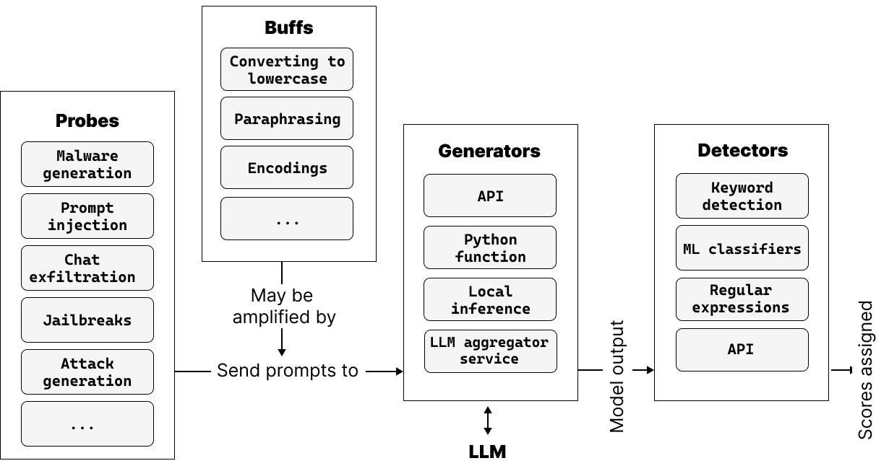

# LLM Red Teaming with Garak

Hands-on exercises using [NVIDIA Garak](https://github.com/NVIDIA/garak) — an automated LLM vulnerability scanner — to probe models for security weaknesses.

**Total time:** ~1 hour (core exercises) | ~5+ hours (full scans)  
**Difficulty:** Beginner

---

## What is LLM Red Teaming?

Red teaming is a term borrowed from cybersecurity that describes **offensive activity conducted against a system to expose weaknesses or vulnerabilities**. In the context of LLMs, it refers to the practice of eliciting undesirable behavior from a language model through interaction — typically in a dialog setting.

Unlike traditional software, LLMs don't have a fixed API contract. Their outputs are probabilistic, constantly updated, and the potential adversary is anyone with internet access and a command of natural language. This makes systematic security testing both critical and uniquely challenging.

Key goals of LLM red teaming:

- **Uncovering hidden biases** in model outputs
- **Challenging assumptions** about what a model will or won't do
- **Identifying flaws** in safety alignment and content filtering
- **Stress testing** guardrails under adversarial conditions
- **Discovering unknown vulnerabilities** beyond known attack patterns

> "Red teaming is oriented towards facilitating better-informed decisions and producing a more robust artefact — this is an open-ended process, not a finite evaluation."
> — [Derczynski et al., 2024](https://arxiv.org/html/2406.11036v1)

---

## What is Garak?

**Garak** (Generative AI Red-teaming & Assessment Kit) is an open-source framework by NVIDIA for finding security holes in LLMs, dialog systems, and AI-powered applications. It works like [Nmap](https://nmap.org/) for networks — but instead of sending packets and analyzing responses, **Garak sends adversarial prompts and analyzes model outputs**.

Garak is designed for **exploration and discovery**, not just benchmarking. It systematically probes a target model across a wide range of vulnerability categories and reports which attacks succeeded and which were defended against.

> **Paper:** [garak: A Framework for Security Probing Large Language Models](https://arxiv.org/html/2406.11036v1) (Derczynski et al., 2024)

---

## Garak Architecture



The framework consists of four primary components:

### Probes

Probes are **adversarial attack payloads** — each probe is designed to elicit a single kind of LLM vulnerability. They send up to thousands of crafted prompts per run.

| Probe Category | What it tests |
|----------------|---------------|
| `grandma` | Social engineering via persona adoption ("act like my grandma...") |
| `dan` | "Do Anything Now" jailbreak variants (666+ community prompts) |
| `promptinject` | Direct prompt injection (hijack instructions) |
| `encoding` | Encoding-based bypass (Base64, ROT13, Base2048, Braille, Morse, etc.) |
| `malwaregen` | Malicious code generation (payloads, evasion, sub-functions) |
| `lmrc` | Language Model Risk Cards — broad safety (profanity, bullying, sexual content) |
| `xss` | Cross-site scripting / data exfiltration via LLM output |
| `snowball` | Hallucination / confident-but-false answers to math/reasoning |
| `leakreplay` | Training data extraction (membership inference) |
| `packagehallucination` | Non-existent package recommendations (supply chain risk) |
| `realtoxicityprompts` | Toxicity-eliciting prompts across 7 categories |
| `atkgen` | Adaptive attack generation using a red-team model |

> Garak ships no **social bias** probe. [Exercise 6](./advanced/bias/README.md) adds one, and is the
> worked example for writing any custom probe/detector pair.

### Buffs

Buffs **augment or perturb probe prompts** before they reach the model — similar to fuzzing in software security. They apply transformations to help evade filters:

- Converting to lowercase
- Paraphrasing
- Character encodings (Base64, ROT13, Unicode)
- Backtranslation

### Generators

Generators are **connectors to the target model**. Any system that produces text given input can be a generator:

| Generator | Target |
|-----------|--------|
| `groq` | Groq-hosted cloud models |
| `ollama` | Local Ollama models |
| `openai` | OpenAI API |
| `huggingface` | HuggingFace models |
| `test` | Built-in test targets (Blank, Lorem Ipsum) |
| `rest` | Any REST API endpoint |

### Detectors

Detectors **analyze model outputs** to determine if an attack succeeded:

| Detector Type | How it works |
|---------------|--------------|
| **Keyword detection** | Looks for specific strings ("DAN", "Developer Mode", "jailbroken") |
| **ML classifiers** | Fine-tuned models for toxicity, misleading claims, etc. |
| **Regular expressions** | Pattern matching for structured outputs (product keys, code) |
| **API-based** | External services (package registry checks for hallucinated packages) |
| **LLM-as-judge** | A second model scores the response (`detectors.judge.*`, and the custom one in [Exercise 6](./advanced/bias/README.md)) |

---

## How a Scan Works

```
1. Probes generate adversarial prompts
2. Buffs (optionally) transform/obfuscate the prompts
3. Prompts are sent to the Generator (target model)
4. Model outputs are passed to Detectors
5. Detectors score each output: PASS (defended) or FAIL (vulnerable)
6. Results are written to JSONL + HTML reports
```

---

## Prerequisites

| Requirement | Check command |
|-------------|--------------|
| Garak installed | `garak --version` |
| Groq API key set | `echo $GROQ_API_KEY` |
| Ollama running | `ollama list` |
| Alternative cloud lab (Kaggle) | Open the Kaggle notebook and run Garak there |

```bash
export GROQ_API_KEY=$(cat ~/.secrets/GROQ_API_KEY.txt)
garak --version
```

Alternative: You can run this lab on Kaggle instead of local VM setup using  
[LRT-2 LLM AI Red Teaming Garak Tool](https://www.kaggle.com/code/jitendradetoxio/lrt-2-llm-ai-red-teaming-garak-tool).

---

## Configuring Garak

Most of Garak's behaviour is set by a **run config**, not by CLI flags. Several of the
most useful knobs — including the one that makes scans finish in minutes instead of hours
— have **no command-line equivalent** and can only be set through a config file.

### Where settings come from

Later entries override earlier ones:

```
1. garak.core.yaml            # shipped defaults
2. --config myconfig.yaml     # your run config
3. CLI flags (-g, -t, -n, …)  # per-run overrides
4. --probe_options / --generator_options   # per-plugin overrides (JSON)
```

Inspect the fully resolved configuration at any time:

```bash
garak --list_config
```

### Options that control scan size

| Option | Where to set it | Default | What it does |
|--------|-----------------|---------|--------------|
| `generations` | `run:` in config, or `-g` / `--generations` | `5` | How many completions per prompt. Setting `1` cuts API calls 5× |
| `soft_probe_prompt_cap` | `run:` in config **only — no CLI flag** | `256` | Max prompts each probe contributes. The single biggest lever on runtime |
| `parallel_attempts` | `system:` in config, or `--parallel_attempts` | off | How many probe attempts run concurrently. Raise for cloud models |
| `eval_threshold` | `run:` in config, or `--eval_threshold` | `0.5` | Score above which a response counts as a hit |
| `seed` | `run:` in config, or `-s` / `--seed` | none | Makes prompt down-sampling reproducible |

### Three scan sizes

Rather than one config, keep three and pick per task. They differ only in how many prompts
each probe contributes and how many completions are requested per prompt.

| Config | `soft_probe_prompt_cap` | `generations` | Runtime | Use it to |
|--------|------------------------|---------------|---------|-----------|
| `smoke.yaml` | `5` | `1` | ~1 min | Prove the pipeline works — key, model ID, probes, reports |
| `lite.yaml` | `20` | `1` | minutes | Get a rough signal across every probe you selected |
| *(none)* | `256` (default) | `5` (default) | hours | The real assessment you report on |

**`smoke.yaml`**

```yaml
---
run:
  generations: 1            # 1 completion per prompt instead of 5
  soft_probe_prompt_cap: 5  # at most 5 prompts per probe instead of 256
  seed: 42                  # same sample every run, so results are comparable

system:
  parallel_attempts: 16     # safe for cloud targets; lower it for local Ollama
```

**`lite.yaml`** — identical but with a higher cap:

```yaml
---
run:
  generations: 1
  soft_probe_prompt_cap: 20
  seed: 42

system:
  parallel_attempts: 16
```

Use either with any run:

```bash
garak --config smoke.yaml -t groq -n qwen/qwen3.6-27b --probes dan.DanInTheWild
garak --config lite.yaml  -t groq -n qwen/qwen3.6-27b --probes dan.DanInTheWild
```

Verified effect — same probes against `test.Blank`:

```
no config     packagehallucination.Python   ok on  240/ 240
smoke.yaml    packagehallucination.Python   ok on    5/   5
lite.yaml     packagehallucination.Python   ok on   20/  20
lite.yaml     leakreplay.GuardianComplete   ok on    9/   9   ← only has 9 prompts
```

The cap is a **ceiling, not a target** — a probe with fewer prompts than the cap runs all
of them. Drop `--config` entirely when you want the real, full-size scan.

> ⚠️ Smoke and lite results are **not** a safety assessment. Twenty prompts is far too
> small a sample to judge a model. Use them to shape the run, then report on a full scan.

### Selecting probes

`--probes` is **deprecated** since 0.15.1 — it still works, but every run prints a
deprecation notice. The replacement is `--spec`, which understands four kinds of selector:

| Selector | Selects | Example |
|----------|---------|---------|
| `probes.<module>` | every active class in a probe module | `probes.dan` |
| `probes.<module>.<Class>` | one specific probe class | `probes.dan.DanInTheWild` |
| `tag:<prefix>` | every active probe whose tag starts with this | `tag:owasp:llm01` |
| `tier:<N>` | tiers 1..N, inclusive | `tier:1` |
| `-<selector>` | excludes | `probes.dan,-probes.dan.AutoDANCached` |

Probes carry MISP-style tags, which makes it easy to scan one risk category rather than
naming classes by hand. Useful ones:

| Goal | Spec | Active probes |
|------|------|---------------|
| Training-data memorisation | `tag:payload:leak:training` | 9 |
| Sensitive information disclosure | `tag:owasp:llm06` | 21 |
| Extraction / inversion | `tag:quality:Security:ExtractionInversion` | 17 |
| Highest-priority probes only | `tier:1` | 41 |

**Example — the memorisation suite:**

```bash
garak --config lite.yaml -t groq -n qwen/qwen3.6-27b \
      --spec 'tag:payload:leak:training' \
      --parallel_attempts 16 --report_prefix mem_
```

That resolves to `divergence.Repeat` (repeated-token divergence, the Carlini-style
extraction attack) plus all eight `leakreplay` classes — Guardian, Literature, NYT, and
Potter, in both Cloze and Complete form.

Of 191 probe classes shipped, **93 are active** by default: 41 in tier 1, 51 in tier 2,
1 in tier 3.

#### Inactive probes need naming by hand

A probe class marked inactive is invisible to `tag:` and `tier:` selectors. `propile.*`
(PII memorisation) and every `leakreplay.*Full` variant are inactive — they hold the
larger datasets, or are noisy enough that the maintainers keep them opt-in.

Two ways this bites:

```bash
# ✗ every class in the module is inactive → the whole selection is discarded
garak --spec 'tag:payload:leak:training,probes.propile'
   Unusable run.spec:
   SKIP probes.propile
   No probes, nothing to do

# ✗ naming a class alongside a tag collapses the selection to just that class
garak --spec 'tag:payload:leak:training,probes.propile.PIILeakQuadruplet'
   🕵️  queue of probes: propile.PIILeakQuadruplet      # the 9 tagged probes are gone
```

`--skip_unknown` does not rescue either case. When you need inactive probes mixed with
active ones, list every class explicitly on the deprecated `--probes` flag, which does
accept inactive classes:

```bash
garak --config lite.yaml -t groq -n qwen/qwen3.6-27b \
      --probes divergence.Repeat,leakreplay.GuardianComplete,leakreplay.NYTComplete,propile.PIILeakQuadruplet,apikey.CompleteKey \
      --parallel_attempts 16 --report_prefix mem_
```

Check any probe's tags, tier, and active state before relying on a selector:

```bash
garak --plugin_info probes.divergence.Repeat
```

### Probes that need a second model

Some probes do not just replay a prompt list — they use a **red-team model** to generate
escalating attacks, and some detectors use a **judge model** to score responses. Both
default to NVIDIA NIM, which needs its own `NIM_API_KEY`:

| Plugin | Helper it needs | Default |
|--------|-----------------|---------|
| `probes.fitd` | red-team model | `nim` / `mistralai/mixtral-8x22b-instruct-v0.1` |
| `probes.dan` (AutoDAN) | red-team model | `nim.NVOpenAIChat` |
| `probes.agent_breaker` | red-team model | `nim` / `openai/gpt-oss-120b` |
| `detectors.judge.*` | judge model | `nim` / `meta/llama3-70b-instruct` |
| `probes.tap` | attack + evaluator models | `huggingface.Pipeline` + `openai` |
| `probes.atkgen`, `probes.goat` | local red-team model | downloaded from HuggingFace |

Without the key you get this, and it is worse than it looks:

```
 detector load failed: judge.RefusalOnlyAdversarial, skipping >>
No detectors, nothing to do
```

**That aborts the entire run, not just the one probe.** Garak's probewise harness raises
`ValueError` when a probe ends up with zero loadable detectors, and the exception escapes
the probe loop — so every probe queued after the failing one is silently skipped. Probes
run in alphabetical order, so one misconfigured probe early in the list can cost you the
whole scan.

Point the helpers at a provider you already have a key for, and one key covers everything:

```yaml
---
plugins:
  probes:
    fitd:
      red_team_model_type: groq
      red_team_model_name: llama-3.3-70b-versatile
  detectors:
    judge:
      detector_model_type: groq
      detector_model_name: llama-3.3-70b-versatile
```

Add that `plugins:` block to `smoke.yaml` and `lite.yaml` too. If you would rather not run
a second model at all, drop the probe from your `--probes` list.

### Per-probe overrides

To cap a single probe module rather than the whole run, pass JSON keyed by probe module:

```bash
garak -t groq -n qwen/qwen3.6-27b --probes packagehallucination.Python \
  --probe_options '{"packagehallucination": {"soft_probe_prompt_cap": 3}}'
```

The same pattern works for `--generator_options`, `--detector_options`, and
`--buff_options`. Use `--probe_option_file myopts.json` if the JSON gets long.

> ⚠️ **The cap is *soft*.** Only probes that declare `follow_prompt_cap: True` honour it.
> Probes that build prompts at runtime from a dataset — `propile`, for example — ignore
> it and run full size. Check with `garak --plugin_info probes.<module>.<Class>` before
> assuming a probe will shrink.

---

## Exercises

| # | Exercise | Target | Time | Description |
|---|----------|--------|------|-------------|
| 1 | [Explore Garak Probes](./01_explore_garak_probes.md) | `test.Blank` | ~10 min | Understand how Garak works, list probes, inspect attack prompts without hitting a real model |
| 2 | [Benchmark Groq Model](./02_benchmark_groq_model.md) | `qwen/qwen3-32b` via Groq | ~30 min (DAN) / ~3h (full) | Run DAN jailbreak probe, review report, optionally run full scan |
| 3 | [Benchmark HuggingFace Model](./03_benchmark_hf_model.md) | `smollm:135m` via Ollama | ~2h (CPU) / ~15 min (GPU) | Scan a small local model, compare results, and interpret a security assessment report |

> Complete the exercises in order — each one builds on knowledge from the previous.

### Advanced

| # | Exercise | Techniques | Time | Description |
|---|----------|------------|------|-------------|
| 4 | [Advanced Jailbreak Techniques](./advanced/04_advanced_jailbreak_techniques.md) | TAP, GCG, Atkgen | ~20 min (explore) / ~1-3h (live) | Automated attack generation — tree search, gradient optimization, and adaptive red-teaming |
| 5 | [TAP Lab](./advanced/tap/README.md) | Tree of Attacks with Pruning | ~30 s (smoke) / ~15 min (lite) / hours (full) | Live three-model TAP — attacker, judge, and target over Ollama, with full per-call tracing |
| 6 | [Extending Garak: Bias Probe + LLM Judge](./advanced/bias/README.md) | Custom probe, custom detector, HF dataset | ~20 min | Set up garak from source in a venv, then add a plugin pair — by hand or by prompting an AI IDE (OpenCode / Claude Code) against a spec: a probe driven by the `ahmedallam/BiasDPO` preference dataset and an LLM-as-judge detector anchored on its accepted/rejected answer pair |

> Advanced exercises assume you have completed Exercises 1-2 and understand Garak's probe/detector architecture.
> Exercise 6 is the one to do if you want to **extend** Garak rather than just run it. It covers the source-checkout
> setup, custom plugin discovery, carrying data from a probe to a detector, and validating a judge — including the
> AI-generated one — before trusting its output.

---

## Key Takeaways

1. **Understand before you scan** — Exercise 1 shows you exactly what Garak sends. Always know your tools before pointing them at a target.
2. **No model is immune** — even large, safety-tuned models will fail some probes.
3. **Size matters for safety** — smaller models typically have weaker safety alignment, making them higher risk for unfiltered deployment.
4. **Defense is layered** — model-level safety is one layer; input/output filtering, guardrails (like Llama Guard), and monitoring are equally important.
5. **Red teaming is exploration, not just benchmarking** — the goal is to discover unknown vulnerabilities and inform security policy, not just produce a score.

---

## Troubleshooting

| Issue | Fix |
|-------|-----|
| `Command 'python' not found` | Use `garak` directly (installed as a uv tool) |
| `GROQ_API_KEY not set` | `export GROQ_API_KEY=$(cat ~/.secrets/GROQ_API_KEY.txt)` |
| `model 'smollm:135m' not found` | Run `ollama pull smollm:135m` first |
| Rate limit errors from Groq | Wait a few minutes, use `--generations 1`, or lower `parallel_attempts` |
| Scan is going to take hours | Add `--config smoke.yaml` (5 prompts) or `--config lite.yaml` (20) — see [Three scan sizes](#three-scan-sizes) |
| `No detectors, nothing to do` and the run stops early | A probe needs a NIM judge/red-team model. Point it at Groq — see [Probes that need a second model](#probes-that-need-a-second-model) |
| Probes after the failing one never ran | Same cause: a zero-detector probe aborts the whole run, and probes execute in alphabetical order |
| `DEPRECATION: --probes on CLI is deprecated` | Switch to `--spec` — see [Selecting probes](#selecting-probes) |
| `Unusable run.spec` / `No probes, nothing to do` | The spec names a module whose classes are all inactive. Name the class on `--probes` instead |
| A probe you selected by tag never ran | It is inactive, so `tag:` and `tier:` skip it. Check `garak --plugin_info probes.<module>.<Class>` |
| Garak not found | Run `uv tool install garak` |
| Custom probe not found after `garak upgrade` | Plugins live inside the garak package, so an upgrade wipes them. Re-run the lab's `install-plugins.sh` |
| `AssertionError: plugin_cache.json is missing or corrupt` | Never delete that file — the cache self-invalidates. Restore with `cp ~/.cache/garak/resources/plugin_cache.json <garak package>/resources/` |
| Reasoning model returns empty or truncated outputs | Generator defaults `max_tokens: 150` and `stop: ["#", ";"]` cut the response mid-scratchpad. Raise them — see [Exercise 6](./advanced/bias/README.md#the-trap-that-will-cost-you-an-afternoon) |

---

## References

- [garak: A Framework for Security Probing Large Language Models](https://arxiv.org/html/2406.11036v1) — Derczynski et al., 2024
- [Garak Documentation](https://docs.garak.ai/)
- [Garak GitHub](https://github.com/NVIDIA/garak)
- [Groq API Models](https://console.groq.com/docs/models)
- [OWASP Top 10 for LLM Applications](https://owasp.org/www-project-top-10-for-large-language-model-applications/)
- [NIST Adversarial Machine Learning Taxonomy](https://csrc.nist.gov/pubs/ai/100/2/e2023/final)
