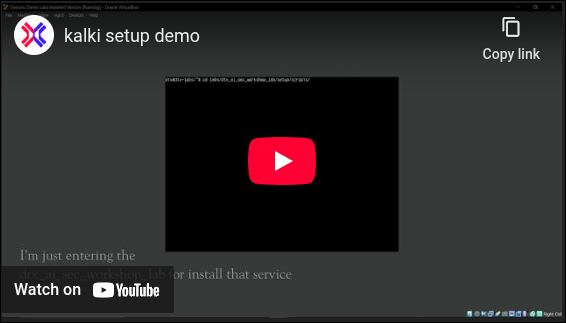
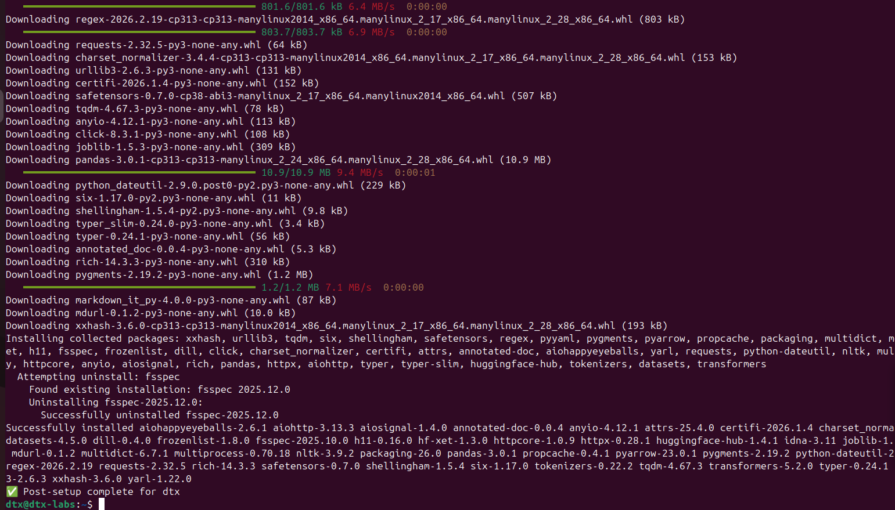

# Introduction

Welcome! 🎉
This guide sets up the **DTX demo lab** using a **Simple Plug and Play VM** (no Terraform, no cloud). You’ll get Docker, uv/Python, Node (via asdf), Go + AppSec tools, Ollama, NGINX, and the Detox labs cloned and ready. 

> Legal note: several tools are offensive-security utilities. Use only on systems you own or have explicit permission to test.

---
## 📂 Virtual Machine Details
- Pre-configured with all required tools  
- Services auto-start: **Nginx, Ollama**  
- Security & AI tooling ready to use out-of-the-box  

---

## 🔑 Credentials
- **User:** `dtx`  
- **Password:** `dtx`  

# Prerequisites

* **OS:** Ubuntu Server 22.04, 24.04 or 25.04 (x86\_64)
* **Hardware (minimum):** **16 GB RAM**, **250+ GB disk**, **4+ vCPU**
* **Tool:** `VirtualBox`
* **Image:** [Kalki.ova](https://huggingface.co/datasets/detoxioai/dtx-ai-sec-lab/blob/main/kalki.ova)

---


# Steps to Setup Labs

[](https://www.youtube.com/watch?v=rKCMBK2kqGM)

## Before you start — read this once

**How to use the commands below.** Every grey box is a command you type into the
**Terminal** inside the VM (open it with `Ctrl` + `Alt` + `T`). Copy one line,
paste it, press `Enter`, and **wait for it to finish** before pasting the next
one. A command is finished when your prompt (`dtx@dtx-labs:~$`) comes back.

**About `sudo`.** Some commands start with `sudo`, which means "run this as the
administrator". The first time you use it, Ubuntu asks for your password — type
`dtx` and press Enter. **You will not see anything appear as you type the
password.** That is normal, not a frozen screen. Just type it and press Enter.

**About the paths.** Every path below is written out in full and starts with
`$HOME` (which means `/home/dtx`, your own folder). That way the command works no
matter which folder you are currently in — you never have to `cd` first.

**These scripts are safe to run more than once.** If something fails halfway, or
you are not sure whether a step worked, just run the same command again. Anything
already installed is detected and skipped, and only the missing pieces get
installed. Nothing is duplicated or broken by a second run.

**Two ways to set up.** Pick **one**:

| | Use this if | Time |
|---|---|---|
| **Option A** | You downloaded the ready-made `Kalki.ova` VM image (most people) | ~30–60 min |
| **Option B** | You are installing onto your own fresh Ubuntu machine | ~60–90 min |

---

## Option A — Pre-built VM (Kalki.ova) — Recommended

### A1. Install VirtualBox and import the VM

1. Install **Oracle VirtualBox** on your own computer.
2. Download [Kalki.ova](https://huggingface.co/datasets/detoxioai/dtx-ai-sec-lab/blob/main/kalki.ova).
3. Double-click `Kalki.ova`. VirtualBox opens and begins importing — this takes a while.
4. When the import finishes, select the VM, click **Settings**, and set:
   - **RAM:** 16 GB (8 GB minimum)
   - **Disk:** 250 GB (50 GB minimum)
   - **CPU:** 8 cores
5. Click **Start** to boot the VM.
6. Log in with username `dtx` and password `dtx`.

### A2. Open a terminal inside the VM

Press `Ctrl` + `Alt` + `T`. Everything from here on is typed in this terminal.

### A3. Get the latest lab files

The labs change between sessions, so always refresh before setting up:

```bash
cd $HOME/labs/AISecWorkshops/ && git stash && git fetch && git pull
```

`git stash` puts aside any changes you made to lab files, so they cannot block
the update. If you want those changes back later, run `git stash pop`.

### A4. Add your API keys

Some labs talk to cloud AI services, which need keys. Run these three commands,
**replacing the text inside the quotes with your real key**:

```bash
mkdir -p $HOME/.secrets
echo 'sk-your-real-openai-key-here' > $HOME/.secrets/OPENAI_API_KEY.txt
echo 'gsk-your-real-groq-key-here'  > $HOME/.secrets/GROQ_API_KEY.txt
echo 'hf-your-real-hf-token-here'   > $HOME/.secrets/HF_TOKEN.txt
```

Where to get each one:

| Key | Get it from | Needed for |
|---|---|---|
| `OPENAI_API_KEY` | <https://platform.openai.com/api-keys> | PyRIT labs, Folly, CS Agent labs |
| `GROQ_API_KEY` | <https://console.groq.com/keys> | Garak Exercise 2, jailbreak labs |
| `HF_TOKEN` | <https://huggingface.co/settings/tokens> (a **read** token is enough) | Downloading models and datasets |

> **Do not skip `HF_TOKEN`.** Without it, model downloads run as an anonymous user
> and HuggingFace throttles them heavily — a download that should take 10 minutes
> can take hours.

**Check it worked** — this should print three lines, none of them `0`:

```bash
wc -c $HOME/.secrets/*.txt
```

If a file shows `0`, the key did not save. Run that `echo` command again.

### A5. Run the tool setup script

This installs the lab tools. It takes **20–40 minutes** and prints a lot of text —
that is normal. Leave it running and do not close the terminal.

```bash
sudo $HOME/labs/AISecWorkshops/labs/setup/vm/Tool_Setup.sh
```

**Check it worked** — the last line should be:

```
✅ Post-setup complete for dtx
```

Now skip ahead to **[Validate Labs After Installation](#validate-labs-after-installation)**.

---

## Option B — Fresh Ubuntu Install (22.04 / 24.04 / 25.04)

Use this only if you are setting up your own Ubuntu machine instead of the
ready-made VM. Do the steps **in order** — B2 needs things that B1 installs.

### B1. Download the lab files

```bash
sudo apt-get update && sudo apt-get install -y git
mkdir -p $HOME/labs
cd $HOME/labs && git clone https://github.com/emulateai-dev/AISecWorkshops.git
```

### B2. Run the system setup script

This installs the base system: SSH, Docker, NGINX, and the programming languages
the tools are built on (Python, Node.js, Go). It also downloads the local AI
models, which are several gigabytes — so this step takes **20–40 minutes**.

```bash
sudo $HOME/labs/AISecWorkshops/labs/setup/vm/Pre_Installation.sh
```

**Check it worked** — the last lines should be a list of green ticks ending with:

```
✅ Setup complete for user: dtx — all checks passed.
```

If you see any red ❌, read the message next to it, fix that one thing, and run
the same command again. The script skips everything that already succeeded.

> **Note for Ubuntu 25.04 users.** Older versions of this guide told you to add a
> "deadsnakes" software source for extra Python versions. **Do not do that on
> 25.04** — it publishes nothing for 25.04, and adding it breaks every future
> `sudo apt-get update` with *"does not have a Release file"*. The script now
> handles this for you: it skips that source on 25.04 and installs the extra
> Python versions through `uv` instead. If a previous attempt already added it,
> re-running the script removes it.

### B3. Add your API keys

Same as Option A — follow **[step A4](#a4-add-your-api-keys)** above, then come back here.

### B4. Run the tool setup script

This installs the lab tools themselves. Takes **20–40 minutes**.

```bash
sudo $HOME/labs/AISecWorkshops/labs/setup/vm/Tool_Setup.sh
```

**Check it worked** — the last line should be:

```
✅ Post-setup complete for dtx
```

---

## What the two scripts install

You do not need to memorise this — it is here so you know where to look when
something is missing.

**`Pre_Installation.sh`** — the *system* layer. Run once per machine.

| Group | What |
|---|---|
| System | SSH, Docker, NGINX, `git`, `jq`, `curl`, build tools |
| Languages | Python (3.10 / 3.12 / 3.13), Node.js, Go — installed via `asdf` and `uv` |
| AI models | All 7 Ollama models, including the 4.9 GB `vulnerable-llama` |
| Config | `$HOME/.secrets` folder, tmux config, NGINX shared folder |

**`Tool_Setup.sh`** — the *tools* layer. Re-run this whenever you want to update.

| Group | What |
|---|---|
| Python tools | `dtx`, `garak`, `huggingface_hub`, `llm`, `cai-framework`, `autogenstudio` |
| Node tools | `promptfoo` |
| Recon tools | `httpx`, `nuclei`, `subfinder`, `amass` (fixed versions) |
| PyRIT | the PyRIT repo, its devcontainer image, and `pyrit-cli` |
| Other | Metasploit, BurpSuite Community, and the `$HOME/.aisecurity` Python environment |

`Tool_Setup.sh` deliberately does **not** install the individual challenge labs
(Folly, EDR, CS Agent, DVMCP, PentAGI, AI Red Teaming Labs). You install only the
ones you need — see
**[Installing Individual Challenge Labs](#installing-individual-challenge-labs)**.

---

## If something goes wrong

| What you see | What it means | What to do |
|---|---|---|
| `Please run with sudo/root` | You forgot `sudo` at the start | Run the same command again with `sudo` in front |
| `does not have a Release file` | A broken software source (usually deadsnakes on 25.04) | Re-run `sudo $HOME/labs/AISecWorkshops/labs/setup/vm/Pre_Installation.sh` — it removes the broken source |
| `permission denied ... docker.sock` | Your account was just added to the `docker` group | Log out and log back in, or run `newgrp docker` |
| `Executable already exists` | Leftover broken links from an older VM image | Re-run `sudo $HOME/labs/AISecWorkshops/labs/setup/vm/Tool_Setup.sh` — it cleans them up |
| A download is extremely slow | `HF_TOKEN` is missing or empty | Do **[step A4](#a4-add-your-api-keys)**, then re-run the script |
| `local changes would be overwritten` | You edited a lab file that the update wants to replace | `cd $HOME/labs/AISecWorkshops/ && git stash && git pull` |
| The script stopped halfway | A download failed or you closed the terminal | Just run the same command again — it continues from where it stopped |

Still stuck? Run the validation script below — it tells you exactly which pieces
are missing.

### Validation: Successful Setup Output

After `sudo ./Tool_Setup.sh` completes, you should see a final success line similar to:

`✅ Post-setup complete for dtx`

Reference screenshot:



### Steps to Upgrade Environment

`Tool_Setup.sh` is idempotent — you can re-run it at any time to install missing
components or refresh the environment. It will skip steps that are already complete.

**Always refresh the repo first.** The lab scripts and challenge files change between
sessions, so pull the latest before re-running any setup step:

```bash
cd ~/labs/AISecWorkshops/
git stash && git fetch && git pull
```

`git stash` shelves any local edits you made to lab files (they would otherwise block
the pull with a "local changes would be overwritten" error). Recover them later with
`git stash pop`, or drop them for good with `git stash drop`.

Then re-run the tool setup:

```bash
sudo ./labs/setup/vm/Tool_Setup.sh
```

### Validate Labs After Installation

Run the validation script to verify installed tools, running services, exposed ports, and API connectivity:

> Note: This validation can take a couple of minutes to complete.

```bash
cd $HOME
./validate_installation.sh
```

If the script is missing in `$HOME`, run it directly from the repo:

```bash
cd $HOME/labs/AISecWorkshops/labs/setup/scripts
./validate_installation.sh
```

Expected output starts with:

`🔍 DTX Validation Log - <date>`

`🌍 External Network Info`

`🌐 External IP: <your-ip>`

Successful completion ends with:

`✅ DTX Validation complete.`

### Installing Individual Challenge Labs

`Tool_Setup.sh` deliberately does **not** install the challenge labs — you install
only the ones you're running that day. Each has its own installer under
`labs/setup/scripts/tools/`. Run them with the **absolute path** so it works from
any directory:

```bash
bash $HOME/labs/AISecWorkshops/labs/setup/scripts/tools/install-folly.sh
```

| Lab | Installer |
|-----|-----------|
| Folly (prompt injection) | `$HOME/labs/AISecWorkshops/labs/setup/scripts/tools/install-folly.sh` |
| Enterprise Deep Research (EDR) | `$HOME/labs/AISecWorkshops/labs/setup/scripts/tools/install-edr.sh` |
| OpenAI CS Agents demo | `$HOME/labs/AISecWorkshops/labs/setup/scripts/tools/install-openai-cs-agents-demo.sh` |
| Damn Vulnerable MCP (DVMCP) | `$HOME/labs/AISecWorkshops/labs/setup/scripts/tools/install-dvmcp.sh` |
| PentAGI | `$HOME/labs/AISecWorkshops/labs/setup/scripts/tools/install-pentagi.sh` |
| AI Red Teaming Playground Labs | `$HOME/labs/AISecWorkshops/labs/setup/scripts/tools/install-ai-red-teaming-playground-labs.sh` |
| DTX Demo Agents | `$HOME/labs/AISecWorkshops/labs/setup/scripts/tools/install-dtx-demo-agents.sh` |
| PyRIT | `$HOME/labs/AISecWorkshops/labs/setup/scripts/tools/install-pyrit.sh` |

Each installer is idempotent — re-running it updates the lab rather than
duplicating it. Run them as your normal user (**not** with `sudo`); they use
`sudo` internally only where they need it.

### Using Python 3.12 (or another version)

Ubuntu 25.04 ships **Python 3.13** as the system interpreter and carries no
`python3.10` / `python3.12` packages in any repo, so `apt install python3.12`
cannot work there. The setup scripts install those versions through **uv**
instead, which ships standalone builds.

To get a 3.12 interpreter path, or a 3.12 virtualenv:

```bash
# where is uv's 3.12?
uv python find 3.12

# install it if the command above finds nothing
uv python install 3.12

# create a 3.12 venv for a lab that needs it
uv venv --python 3.12 ~/.venv-py312
source ~/.venv-py312/bin/activate
```

The default `~/.aisecurity` venv is built against whichever interpreter is
current (3.13 on 25.04). That is fine for every day-1 lab; only switch if a
specific lab pins 3.12.

### Enable Ports Forwarding to Host

#### Assuming NAT Interface

##### **Enable ports inside the VM Instance**

```
cd ~/labs/AISecWorkshops/ && git stash && git fetch && git pull && cd $HOME
sudo $HOME/labs/AISecWorkshops/labs/setup/scripts/tools/open_ufw_ports.sh
```

##### **Enable port forwaring at VM instance at VMbox level**

**Crucial Prerequisite for Both Methods:**
Before you start, open the VirtualBox application and ensure your **"DTX AI Security Labs GUI"** virtual machine is completely **Powered Off**. This will prevent the "machine is already locked" error.

-----

### Option 1: Using the VirtualBox Graphical Interface (GUI)

This method involves manually adding each rule through the VirtualBox settings window. It's straightforward but requires repeating steps.

1.  **Open VirtualBox** and select the `"DTX AI Security Labs GUI"` VM from the list.

2.  Click the **Settings** button (the gear icon).

3.  In the Settings window, go to the **Network** section.

4.  Make sure **Adapter 1** is enabled and **Attached to: NAT**.

5.  Expand the **Advanced** section by clicking on it.

6.  Click the **Port Forwarding** button. This will open a new window showing the list of rules.

7.  Click the **"Adds new port forwarding rule"** icon (a green square with a `+`).

8.  A new row will appear. Fill in the details for the first port. For example, for port **11436**:

      * **Name:** `tcp-11436` (this is just a description)
      * **Protocol:** `TCP`
      * **Host IP:** Leave this blank (it will listen on all host network interfaces)
      * **Host Port:** `11436`
      * **Guest IP:** Leave this blank
      * **Guest Port:** `11436`

9.  **Repeat Step 7 and 8** for every single port in your list.

10. Once you have added all the rules, click **OK** on the Port Forwarding window, and then **OK** on the main Settings window to save everything.

-----

### Option 2: Using a Single Command in Your Host's Terminal

This method is much faster as it uses a single command to add all the rules at once. This should be run on your main computer, not inside the VM.

1.  **Open a terminal or command prompt on your host machine:**

      * **Windows:** Open **PowerShell** or **Command Prompt**.
      * **macOS / Linux:** Open the **Terminal** application.

2.  **Copy and paste the entire command block below** into your terminal. This command contains your specific VM name and the complete list of ports.

    ```bash
    for port in 11434 11436 17860 17861 17862 17863 18000 18001 18081 28080 8080 3389 10001 3000 15000 14000 14001 14002 14003 14004 14005 14006 14007 14008 14009 14010 14011 14012 18567 18568 18569 18570 18571 18572 18573 18574 18575 18576; do echo "Adding rule for port $port..."; VBoxManage modifyvm "DTX AI Security Labs GUI" --natpf1 "tcp-$port,tcp,,$port,,$port"; done; echo "All rules added successfully."
    ```

3.  **Press Enter to run the command.** It will loop through each port and apply the forwarding rule automatically.

### Final Step (After Using Either Option)

After you have added the rules using either the GUI or the command line, you can **start your VM**. The final and necessary step is to **configure the firewall inside the Ubuntu VM** to allow incoming traffic on these same ports.


## Additional Configs 
- Create SSH key using 
``` bash
ssh-keygen -t ed25519 -C "your_email@example.com"
```
- and paste the id_ed25519.pub in the ```~/.ssh/authorized_keys``` 
- Now you can access the machine using your hostmachine terminal without password 
``` bash
ssh dtx@< machine ip >
```

# **Frequently Asked Questions (FAQ) for VirtualBox Errors**

This guide provides solutions to common errors encountered when setting up virtual machines in Oracle VirtualBox, particularly on a Linux host system.

Of course. Here is the extended FAQ guide, incorporating the common USB permissions error and the OVA import issue you mentioned, while maintaining the clear, solution-oriented format of the original text.

-----

### Frequently Asked Questions (FAQ) for VirtualBox Errors

This guide provides solutions to common errors encountered when setting up and managing virtual machines in Oracle VirtualBox, particularly on a Linux host system.

#### 1\. Network Adapter Not Found Error

  * **Q: Why does VirtualBox show the error "Could not start the machine... because the following physical network interfaces were not found"?**
  * **Symptom:** You try to start your VM and receive an error message listing a specific network card that was not found, such as "MediaTek Wi-Fi 6 MT7921 Wireless LAN Card".
  * **Cause:** This happens because your VM's network settings are configured in **"Bridged Adapter"** mode and are tied to a *specific* physical network card on your computer. VirtualBox cannot start the VM because it can't find or access that exact card. This could be because your Wi-Fi is off, you've moved the VM to a new computer, or the card's name has changed.
  * **Solution (Recommended): Switch to NAT**
    This is the easiest fix and works for most use cases, allowing your VM to access the internet.
    1.  Select your VM in the VirtualBox main window and click **Settings**.
    2.  Go to the **Network** tab.
    3.  In the **"Adapter 1"** tab, find the **"Attached to:"** dropdown menu.
    4.  Change the selection from "Bridged Adapter" to **"NAT"**.
    5.  Click **OK** and start your VM.
  * **Solution (Alternative): Re-select the Bridged Adapter**
    Use this option only if you specifically need your VM to appear as a separate device on your local network.
    1.  Go to **Settings \> Network \> Adapter 1**.
    2.  Ensure **"Attached to:"** is set to "Bridged Adapter".
    3.  In the **"Name:"** dropdown menu below it, select a **currently active** network connection from the list (e.g., your Ethernet port or a different Wi-Fi adapter).
    4.  Click **OK** and start your VM.

#### 2\. KVM / AMD-V Virtualization Conflict

  * **Q: How do I fix the error "VirtualBox can't enable the AMD-V extension. Please disable the KVM kernel extension... (VERR\_SVM\_IN\_USE)"?**
  * **Symptom:** Your VM fails to start, and the error message mentions **AMD-V** (for AMD CPUs) or **VT-x** (for Intel CPUs) and complains that it is already in use (`VERR_SVM_IN_USE`). It specifically mentions disabling **KVM**.
  * **Cause:** Your computer's CPU has hardware virtualization features that allow VMs to run efficiently. However, only **one program** (a hypervisor) can use these features at a time. On Linux, the built-in hypervisor is called **KVM** (Kernel-based Virtual Machine). This error means KVM is currently active, preventing VirtualBox from accessing the CPU's virtualization features.
  * **Solution (Temporary Fix): Unload the KVM Module**
    This is the best option if you switch between VirtualBox and other virtualization tools (like QEMU/GNOME Boxes). This command is temporary and will reset upon reboot.
    1.  Open a Terminal on your host Linux machine.
    2.  Run the following commands to unload the KVM modules:
        ```bash
        # For AMD Processors
        sudo modprobe -r kvm_amd
        sudo modprobe -r kvm

        # For Intel Processors
        # sudo modprobe -r kvm_intel
        # sudo modprobe -r kvm
        ```
    3.  Try starting your VirtualBox VM again. It should now work.
  * **Solution (Permanent Fix): Blacklist the KVM Module**
    Use this option only if you plan to use VirtualBox exclusively for virtualization.
    1.  Open a Terminal and create a new configuration file with a text editor:
        ```bash
        sudo nano /etc/modprobe.d/blacklist-kvm.conf
        ```
    2.  Add the following lines to the file (use `kvm_amd` for an AMD system):
        ```
        blacklist kvm_amd
        blacklist kvm
        ```
    3.  Save the file and exit (`Ctrl+X`, then `Y`, then `Enter`).
    4.  **Reboot your computer.** KVM will no longer load on startup.

#### 3\. USB Device Access Forbidden Error

  * **Q: Why can't VirtualBox access my USB devices? I get an `NS_ERROR_FAILURE (0X00004005)` error.**
  * **Symptom:** When you try to attach a USB device to a running VM (via the `Devices > USB` menu), you get an error dialog. The details mention `NS_ERROR_FAILURE` and a message like "VirtualBox is not currently allowed to access USB devices."
  * **Cause:** For security, Linux operating systems do not let standard users have low-level control over hardware. The VirtualBox installation creates a special user group called `vboxusers` specifically for this purpose. If your user account is not a member of this group, the OS will deny VirtualBox's request to connect a USB device.
  * **Solution: Add Your User to the `vboxusers` Group**
    1.  Open a Terminal.
    2.  Run the following command to add your current user to the group. You will need to enter your password.
        ```bash
        sudo usermod -aG vboxusers $USER
        ```
    3.  **This is the most important step:** The change only takes effect after a new session starts. You must either **log out and log back in**, or simply **reboot your computer**.
    4.  (Optional) After logging back in, you can verify your membership by typing `groups` in a terminal and checking for `vboxusers` in the output.
    5.  Remember, for full USB 2.0/3.0 support, you must also install the **VirtualBox Extension Pack** from the official website.

#### 4\. `uv` Cache / Tool Setup Issues

  * **Q: `Tool_Setup.sh` fails or behaves inconsistently after package/tool updates. How do I reset `uv` cache?**
  * **Symptom:** You may see partial installs, stale wheels/sdists, or repeated setup issues.
  * **Cause:** Old cache artifacts in `~/.cache/uv` can sometimes conflict with fresh installs.
  * **Solution: Clean `uv` cache and rerun setup**
    1.  (Optional) Inspect the cache:
        ```bash
        ls ~/.cache/uv
        ```
    2.  Remove the cache directory:
        ```bash
        rm -rf ~/.cache/uv
        ```
    3.  Re-run setup from the VM setup directory:
        ```bash
        cd $HOME/labs/AISecWorkshops/labs/setup/vm
        sudo ./Tool_Setup.sh
        ```
    4.  Verify key tools:
        ```bash
        garak --version
        ollama list
        ```

